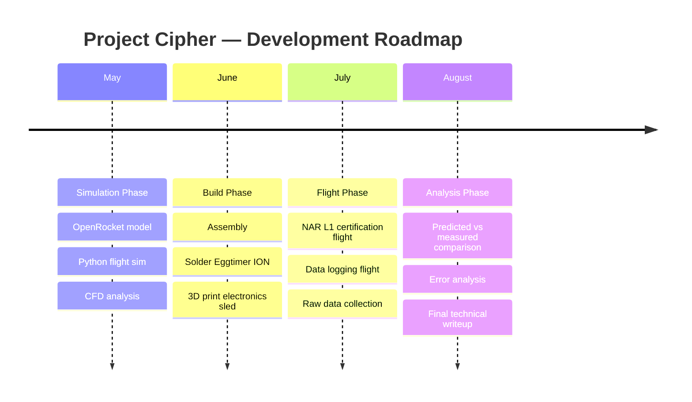

# Project Cipher

## Overview

Project Cipher is a beginning-to-end rocket engineering project involving computational simulation, physical hardware design, and real flight data analysis.

---

## Objectives

- Model rocket flight dynamics in Python (drag, thrust, gravity, trajectory)
- Simulate the same rocket in OpenRocket and validate both models against each other
- Run CFD analysis on nosecone and fin geometry using SimScale
- Build a LOC Hi-Tech H-motor rocket with a custom 3D printed electronics bay
- Achieve NAR Level 1 certification
- Fly with onboard data logging and compare real flight data to simulation predictions
- Quantify and analyze sources of error between predicted and measured performance

---

## Hardware

| Component | Spec |
|---|---|
| Rocket kit | LOC Precision Hi-Tech (PK-56) |
| Diameter | 2.63" |
| Length | 49.75" |
| Motor | Aerotech H128W-14A |
| Flight computer | Eggtimer ION WiFi data logger |
| Custom parts | Von Kármán nosecone + electronics sled (PETG, designed in SolidWorks) |

---

## Software & Tools

| Tool | Purpose |
|---|---|
| Python (NumPy, SciPy, Matplotlib) | Custom flight simulation |
| OpenRocket | Rocket design and trajectory simulation |
| SimScale | CFD analysis of aerodynamic surfaces |
| Onshape | CAD design of custom 3D printed components |
| Pandas | Flight data processing and analysis |

---

## Repository Structure

```
project-cipher/
├── README.md
├── simulation/
│   ├── openrocket/        ← .ork design and simulation files
│   └── python/            ← custom flight simulation scripts
├── cfd/                   ← SimScale results and screenshots
├── data/                  ← Eggtimer ION CSV flight data
├── analysis/              ← predicted vs measured comparison plots
├── cad/                   ← Onshape exports of electronics sled
└── report/                ← technical writeup and documentation
```

---

## Project Timeline



---

## Results

*To be updated after flight.*

---

## About

